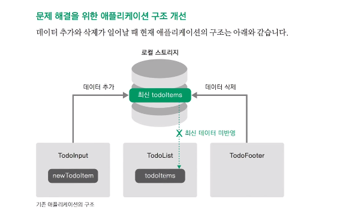
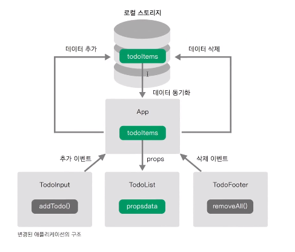

# todo-client
### Vue.js를 이용한 Todo App 구현
   
---

## Requirements
- TodoHeader, TodoInput, TodoList, TodoFooter Component로 구성
- 할 일 추가 기능
  - [x] 할 일을 입력하고 엔터를 입력하면 할 일이 추가된다.
  - [x] 할 일을 입력하고 + 버튼을 클릭하면 할 일이 추가된다.
  - [x] 아무 입력 값 없이 할 일 추가 이벤트를 발생시키면 경고창이 뜬다.
- 할 일 목록 표시 기능 
  - [x] 추가한 할 일 목록을 보여준다.
- 할 일 삭제 기능
  - [x] 삭제한 할 일은 목록에서 삭제한다.
- 할 일 완료 기능 
  - [x] 완료한 할 일은 취소선으로 변경한다.

---
## 간단한 개념 정리

### Vue.js
- Directive
    - v-model 
        - **양방향 바인딩 지원**
        - 입력 데이터와 vue instance의 data 간의 binding하는 역할 
        - vue instance의 data에 값을 설정해두면 DOM의 input element에 설정된다.
    - v-on 
        - DOM에서 일어나는 이벤트를 listen하는 역할 
        - vue instance의 함수와 binding
        - **v-on:이벤트 종류="함수 이름"**
            - `<form v-on:submit.prevent="onSubmit">`
            - **.prevent**: e.preventDefault의 역할 (화면 갱신을 막는다.)
            - `<form v-on:click.stop="onClickRemoveHistory(item.keyword)">`
            - **.stop:** 이벤트 전파(bubbling) 방지 
    - v-if / v-else
        - 해당하는 값이 참일 때만 DOM을 출력하는 역할 
    - v-for
        - 해당하는 값을 순차적으로 받아오는 역할
    - v-bind
        - attribute의 값을 지정하는 역할     
        - ``
        - **v-bind:"지정한 속성"="{설정할 값: 설정 조건}**
            - `<li v-for="tab in tabs" v-bind:class="{active: tab === selectedTab"> {{tab}} </li>`
- props
    - Vue.js에서 부모-자식 Component 관계에서
        - props는 아래로!
        - events 위로!
        - 즉, 부모는 props를 통해 자식에게 데이터를 전달하고 자식은 events를 통해 부모에게 메시지를 보낸다. 
    - 모든 Component instance에는 자체 격리된 범위가 있다. 
        - 즉, 하위 컴포넌트의 템플릿에서 상위 데이터를 직접 참조할 수 없다.
        - 데이터는 props 옵션을 사용하여 하위 컴포넌트로 전달할 수 있다.
- Container Component와 Presentational Component의 분리 
  - App.vue(Container Component)
    - 다른 Component가 공통적으로 사용하는 데이터를 가지고 조작하는 역할을 담당한다.
  - 다른 Component(Presentational Component)
    - 해당 template에서 이벤트가 발생하면 App.vue에 알린다.
    - 그에 대한 결과 데이터를 props를 이용해 받는다.
    - 상위 Component에서 받은 데이터를 이용해 화면을 갱신한다.
  - before
  

  - after
  


### ES5의 기본 개념 및 특징
- 함수 선언식과 함수 표현식
 ```js
// function statement
function sum() {
    return 10 + 20;
}
// function expression (; 존재)
var sum = function () {
    return 10 + 20;
};
 ```
- 변수의 Scope
    - `{}`에 상관없이 스코프가 설정됨
```javascript
var sum = 0;
for(var i = 1; i <= 5; i++) {
    sum = sum + i;
}
console.log(sum); // 15
console.log(i); // 6
```
- Hoisting(끌어올리다.)
    - Hoisting이란 선언한 함수와 변수를 해석기가 가장 상단에 있는 것처럼 인식한다.
    - js 해석기는 코드의 라인 순서와 관계 없이 **함수 선언식**(함수 표현식 X)과 **변수**를 위한 메모리 공간을 먼저 확보한다.
    - 따라서, `function a()`와 `var`는 코드의 최상단으로 끌어 올려진 것(hoisted)처럼 보인다.
 ```js
 function willbeoverridden() {
     return 10;
 }
 willbeoverridden(); // 5
 function willbeoverridden() {
     return 5;
 }
 ```
 ```js
 /* 예시 */
 var sum = 5;
 sum = sum + i;
 function sumAllNumbers() {
     // ...
 }
 var i = 10;

 /* js 해석기에 따른 순서 재조정 결과 */
 // #1 - 함수 선언식과 변수 선언을 hoisting
 var sum;
 function sumAllNumbers() {
     // ...
 }
 var i;
 // #2 - 변수 대입 및 할당
 sum = 5;
 sum = sum + i;
 i = 10;
 ```

### ES6
- [Babel](https://babeljs.io/)
    - 구 버전 브라우저 중에서는 ES6의 기능을 지원하지 않는 브라우저사 있으므로 **transpiling**이 필요
    - ES6의 문법을 각 브라우저의 호환 가능한 ES5로 변환하는 컴파일러
    - Babel 온라인 에디터: [https://babeljs.io/repl/](https://babeljs.io/repl/)
- 새로운 변수 선언 방식 - const, let
    - 블록 단위 `{}`로 변수의 범위가 제한되었음
     ```js
     let sum = 0;
     for (let i=1; i<=5; i++) {
         sum = sum + i;
     }
     console.log(sum); // 10
     console.log(i); // Uncaught ReferenceError: i is not defined
     ```
    - `const`: 한번 선언한 값에 대해서 변경할 수 없음(상수 개념)
     ```js
     /* 예시 */
     const a = 10;
     a = 20; // Uncaught TypeError: Assignment to constant variable

     /* [주의!] 하지만, 객체나 배열의 내부는 변경할 수 있다. */
     const a = {};
     a.num = 10;
     console.log(a); // {num: 10}

     const b = [];
     b.push(20);
     console.log(b); // [20]
     ```
    - `let`: 한번 선언한 값에 대해서 다시 선언할 수 없음(메모리에 할당하면 다시 할당하지 못함), 변경은 가능 
    - 간단한 scope 예시
     ```js
     function f() {
         {
            let x;
            {
                // 새로운 블록 안에 새로운 x의 스코프가 생김
                const x = "sneaky";
                x = "foo"; // 위에 이미 const로 x를 선언했으므로 다시 값을 대입하면 Error
            }
            // 이전 블록 범위로 돌아왔기 때문에 'let x'에 해당하는 메모리에 값을 대입
            x = "bar";
            let x = "inner"; // SyntaxError: Identifier 'x' has already been declared
         }
     }
     ```
- 화살표 함수 (Arrow Function, Fat Arrow)
  - 함수를 정의할 때 `function`이라는 키워드를 사용하지 않고 `=>`로 대체
  - 흔히 사용하는 **콜백 함수**의 문법을 간결화
   ```js
   // ES5 함수 정의 방식 (function expression)
   var sum = function (a, b) {
       return a + b;
   };

   // ES6 함수 정의 방식
   var sum = (a, b) => {
       return a + b;
   }
   sum (10, 20);
   ```
   ```js
   /* 화살표 함수 사용 예시 */

   var arr = ["a", "b", "c"];
   // ES5
   arr.forEach(function(value){ // 익명 함수
       console.log(value); // a, b, c
   });
   // ES6
   arr.forEach(value => console.log(value)); // a, b, c
   ```
- 향상된 객체 리터럴 (Enhanced Object Literals)
  - 객체의 속성을 메서드로 사용할 때 `function`예약어를 생략하고 생성 가능
   ```js
   // 객체 
   var dictionary = {
       words: 100, 
       /* 속성 메서드: 속성에 function을 연결 */
       // ES5
       lookup: function() {
           console.log("find words");
       },
       // ES6 - ': funtion' 생략 
       lookup() {
           console.log("find words");
       }
   };
   ```
  - 객체의 속성명과 값 명이 동일할 때 아래와 같이 축약 가능
   ```js
   var figures = 10;
   var dictionary = {
       // figures: figures,
       figures
   };
   ```
- Modules - 자바스크립트 모듈화 방법
  - 자바스크립트 모듈(특정 기능을 수행하는 한 단위) 로더 라이브러리(AMD, Commons JS)기능을 js언어 자체에서 지원
  - 모듈화 하는 이유
    - 재사용성
    - 변수 scope 충돌 방지
    - 안정성있는 코딩 가능
    - Modules: lib에서 지원하던 것을 언어 차원에서 지원함으로써 개발자들의 수고를 덜어줌
  - 호출되기 전까지는 코드 실행과 동작을 하지 않는 특징이 있음
   ```js
   // libs/math.js
   export function sum(x, y) {
       return x + y;
   }
   export var pi = 3.141592;

   // main.js
   import {sum} from libs/math.js;
   sum(1, 2);
   ```
  - `defualt` export
    - 하나의 파일에서 하나만 export 할 수 있다.
    - encapsulation으로 모듈화
    - 다른 파일에서 가져다가 사용할 때 원하는 이름을 설정하여 사용할 수 있다.
   ```js
   // util.js
   export default function(x) {
       return console.log(x);
   }
   // main.js
   import util from `util.js`;
   console.log(util); // function(x) {return console.log(x);}
   ```

## Development Environment
- [Vue.js](https://vuejs.org/)

## References
* [장기효 (캡틴판교) - Vue.js 중급 강좌, 웹앱 제작으로 배워보는 Vue.js, ES6, Vuex](https://www.inflearn.com/course/vue-pwa-vue-js-%EC%A4%91%EA%B8%89/)
* [WeareSoft - JavaScript 정리 참고](https://github.com/WeareSoft/tech-interview/blob/master/contents/javascript.md)
